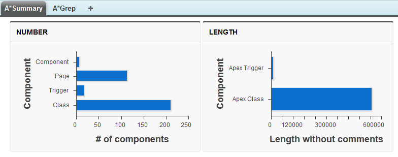
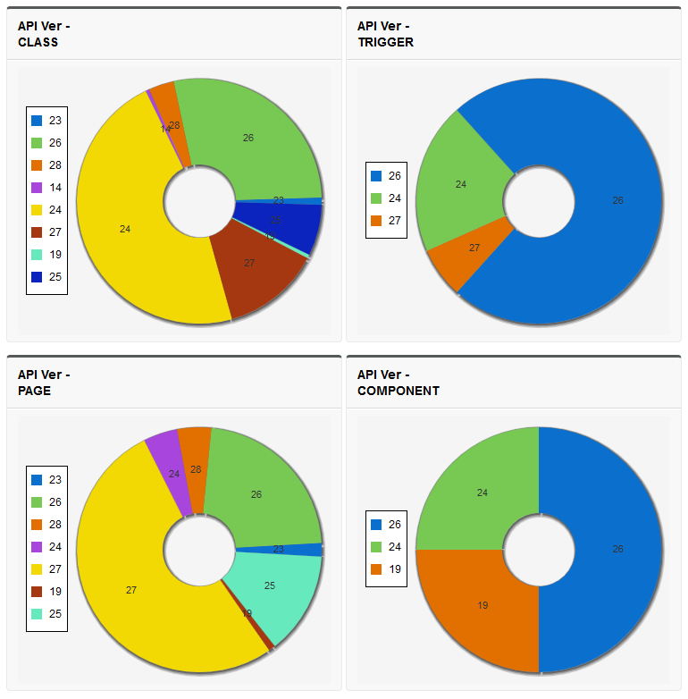
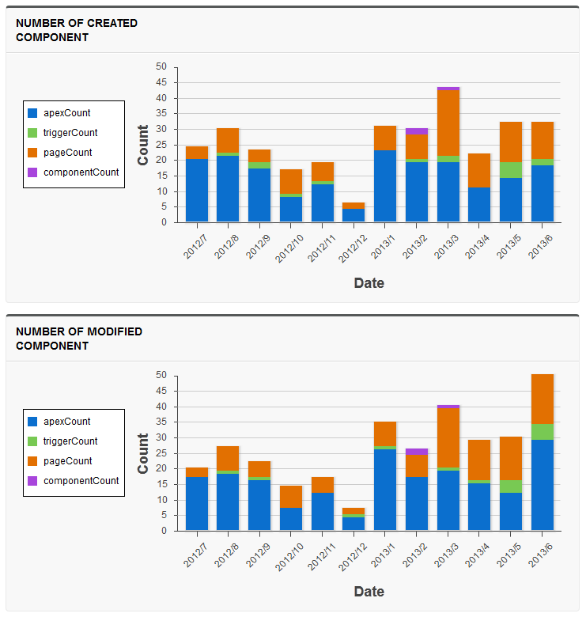

# A*Summary

_Summary report for Apex class, trigger, page and component_

* Number of all components
* Length without comments(class and trigger)
* API version of all components
* Number of all created components
* Number of all modified components

## Screenshot





## Deploying

1. Install Salesforce Migration Tool  
[Force.com Apex Code Developer's Guide](http://www.salesforce.com/us/developer/docs/apexcode/Content/apex_deploying_ant.htm)

2. Modify *build.properties* correctly
```
sf.serverurl=<serverurl>
sf.username=<username>
sf.password=<password>
```

3. Deploy the code
```
$ ant deploy
```
4. Make *A*Summary* tab visible in your profile

## Testing

Run *ASummaryController_TEST.cls*

## License

Released under the [MIT Licenses](http://opensource.org/licenses/MIT)
